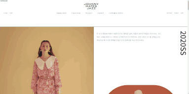
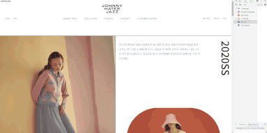

# 쟈니 헤잇 재즈 리뉴얼

## 디자인 컨셉

사랑스러우면서도 빈티지한 기존 브랜드 컨셉에 2020SS 시즌의 컨셉인 한 여름의 피크닉을 합하여 `지난 여름의 피크닉을 회상하다`라는 컨셉으로 디자인하였습니다. 앨범을 넘겨보는 느낌으로 이미지 슬라이드를 구성하였고 빈티지 로켓 목걸이를 연상시키는 타원형을 사용하여 빈티지하면서도 트렌디한 느낌을 주었습니다. 또한 보더 라인을 강조하여 앨범 페이지를 보는 것 같은 레이아웃을 구성하였습니다.

## Pages

- index



마치 앨범을 보는 듯한 디자인 구성으로 `사랑스러움`, `빈티지`, `따사로움`, `추억` 등 브랜드 컨셉과 시즌 컨셉을 사용자에게 전달하였습니다. 오전에서 저녁까지의 시간의 흐름을 주황 - 빨강 - 보라 등 메인 컬러의 변화로 나타내었습니다. 스크롤에 따라 scale의 변화, opacity의 변화 등 최근 절대적인 웹 트렌드인 스크롤 애니메이션을 구현하여 사용자의 흥미를 유발시키고자 하였습니다.

## 구현 기능

- 이미지 슬라이드 : 옆으로 넘어가는 형식의 이미지 슬라이드로 마치 앨범을 넘기는 듯한 느낌을 주기 위해 이미지 슬라이드에 마우스가 올라가면 커스텀 된 커서가 나오게 구현하였습니다.
- 스크롤 애니메이션 : 각 요소의 애니메이션이 시작되는 위치와 끝나는 위치를 설정하고 스크롤 값에 따라 값을 계산하여 transform, opacity, postion등을 변경하여 다채로운 스크롤 애니메이션을 구현하였습니다.
- 모바일 네비게이션 : 1024px 이하로 창너비가 작아지면 모바일 네비게이션이 나타나게 하였습니다.

## 반응형



데스크탑을 기준으로 디자인되었으며 1200px 이상, 1200px이하 ,997px이하를 분기로 반응형을 구현하였습니다.

## 지난 프로젝트와의 차이점

특히 이 웹사이트는 작년 학원을 다닐 때 만들었던 사이트를 새롭게 코딩한 것입니다. 기존에 만들었던 사이트를 재구축하면서 느꼈던 점들이 있습니다.

1. HTML 마크업

```index.html
 <div class="artWrap">
  <article>
    <h3>SHIRRING TULLE BLOUSE</h3>
    <div class="imgWrap">
      <div class="image i1">SHIRRING TULLE BLOUSE</div>
    </div>
  </article>
  <h4>Color : Purple/Mint - ￦328,000</h4>
</div>
```

- 기존의 코드

```index.html
  <article class="collection-item">
    <div class="segment">
      <h3 class="collection-item-title">SHIRRING TULLE BLOUSE</h3>
      <div class="img-wrapper bg">
        <a href="#">
          
        </a>
      </div>
    </div>
    <span class="option-label">
      Color : Pink/Navy - &#65510;248,000
    </span>
  </article>
```

- 리뉴얼된 코드

기존의 마크업은 요소마다 클래스를 주지 않았고 마음대로 클래스 명을 줄여서 다른 사람과 협업하거나 나중에 HTML을 수정할 때 의미를 명확히 파악하기 어려웠습니다. 또한 section 태그를 사용해야 할 부분에 div태그를 사용한 부분도 종종 보였습니다. 이러한 점을 개선하기 위해 각 요소에 명확한 의미의 클래스를 부여하였고 section 태그를 적절히 사용하여 컨텐츠를 구분하였습니다.

2. CSS 스타일링

```index.css
div.shopTheCollect > .artWrap > article > h3 {
  border-bottom: 2px solid #363636;
}

div.shopTheCollect > .artWrap > article > .imgWrap > .image {
  height: 1200px;
}
```

- 기존의 코드

```index.css
.season .content-body {
  display: flex;
}
.season .content-section {
  width: 50%;
}
.season .slide {
  border-right: 2px solid #232323;
}
```

- 리뉴얼된 코드

기존에 학원에서 배운 CSS 작성 방식은 자식 선택자를 사용하여 해당 요소에 있는 모든 부모 요소를 자식선택자로 연결하는 방식이었습니다. CSS의 우선 순위를 높이기 위해 그렇게 사용해야 한다고 배웠습니다. 그러나 이 같은 방식아 CSS 문서의 가독성을 저해하는 요인임을 알게 되었고 특별한 사유가 있지 않은 한 자식 선택자의 사용을 자제하고 1 ~3개로 선택자의 개수를 조정하는 것이 바람직하다는 것을 알게 되었습니다. 그렇게 알게 된 내용을 바탕으로 CSS을 보다 간결하게 작성할 수 있게 되었습니다.

3. JQuery를 JavaScript로

```index.js
  $imgWrap.each(function (i) {
    $(window).on("scroll", function () {
      $img[i] = $imgWrap.eq(i).children(".image");
      oTop = $imgWrap.eq(i).offset().top;
      sTop = $("html").scrollTop();
      winHeight = window.innerHeight;
      imgWrapHeight = $imgWrap.innerHeight();
      startPos = oTop - winHeight;
      endPos = oTop - imgWrapHeight / 2;
      posValue = ((endPos - sTop) * 25) / 337;
      posValue = (75 + posValue) / 100;

      if (sTop >= startPos && sTop < endPos) {
        console.log(oTop);
        $img[i].css({ transform: "scale(" + posValue + ")" });
      }
    });
  });
```

- 기존의 코드

```index.js
const scaleAnimation = (element) => {
    const startPosition =
      window.pageYOffset +
      element.getBoundingClientRect().top -
      window.innerHeight;
    const endPosition = startPosition + element.offsetHeight / 2;
    const currentscrollPosition = window.pageYOffset - startPosition;
    const scrollRange = endPosition - startPosition;
    const scrollRatio = currentscrollPosition / scrollRange;
    if (
      window.pageYOffset > startPosition &&
      window.pageYOffset < endPosition
    ) {
      element.style.transform = `scale(${1 - scrollRatio * 0.25})`;
    }
  };
```

- 리뉴얼된 코드

기존에 만들어진 프로젝트는 제이쿼리를 사용하여 동적 움직임을 구현하였습니다. 변수를 선언할 때도 var 키워드를 사용하였고 변수 작명법도 명확하지 않았습니다. 또한 구체적인 숫자를 계산 값으로 애니메이션을 구현하여 반응형에 대응할 수 없었습니다. 학원 종강 후 순수 JavaScript의 중요성을 알게 되었고 ES6 문법도 새로 알게 되었습니다. JavaScript의 기본기를 탄탄히 해두면 플러그인에 의존하지 않아도 원하는 기능을 구현할 수 있고 후에 다른 라이브러리나 플러그인도 훨씬 수월하게 사용할 수 있기에 JavaScript의 기본기를 탄탄히 다지려고 노력하였습니다. 이번 웹사이트를 구현할 때는 JavaScript만을 사용하여 슬라이드, 모바일 네비게이션, 스크롤 애니메이션을 구현하였습니다. 특히 구체적인 숫자로 값을 계산하는 것이 아닌 자바스크립트 api를 통해 받아온 값을 사용하여 반응형에도 대응할 수 있게 코드를 작성하였습니다.

4. 깨달은 점 : 학원을 다니면서 HTML이나 CSS에는 자신감이 있었지만 새롭게 프로젝트를 진행하면서 사실은 많이 부족한 상태였다는 점을 깨닫고 큰 좌절을 느꼈습니다. 그러나 부족한 점을 점점 채워가며 퍼블리싱에 자신감을 얻게 되었고 기존의 코드와 지금을 코드를 비교해보며 많이 발전했다는 사실에 뿌듯함을 느꼈습니다. 이번 프로젝트를 계기로 잘 안다고 생각했던 부분들도 다시 한번 되돌아보고 여러 자료를 찾아가며 더 좋은 코드를 작성할 수 있도록 발전하는 퍼블리셔가 되겠습니다.
